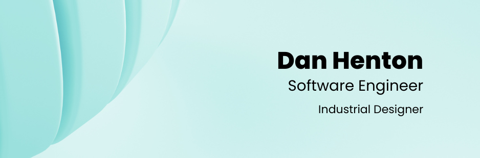

  
   
  

    Hey 👋! I'm a software engineer who is passionate about exploring emerging technologies, always striving to expand the horizons of what's possible.
  

  

    🛠️ Building the Future in Rust, Ruby & TypeScript! Data wizard with a knack for elegant solutions. 
  

  

    🚢 Navigating Polkadot seas with substrate expertise. 
  

  

    📐 CAD Modeling, I manifest ideas into existence.
  

  <h2>Skills 🔥</h2>
  
  
  
  
  
  
  
  
  

  
  
  
  
  

  
  
  
  
  
  
  
  
  
  
  
  
  
    
   
  

  <h2>Links 🔗</h2>
  
  

